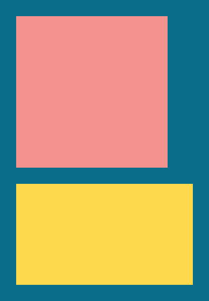

# Examples

## Prelude

For the purpose of these examples, the following color constants were defined.

```c
#define BLUE 0x0a6d89ff
#define PINK 0xf1928fff
#define YELLOW 0xfed84dff
```

## Simple element

A single element with a fixed size and a blue background color.


```c
NUI {
    nui_fixed(960, 540);
    nui_background_color(BLUE);
}
```

## Simple two elements

Two elements, a pink one within a blue one. Nothing particular.


```c
NUI {
    nui_fixed(960, 540);
    nui_background_color(BLUE);

    NUI {
        nui_fixed(300, 300);
        nui_background_color(PINK);
    }
}
```

## Simple padding

Padding is added to the parent parent element, nudging its children (the pink element) away from the edges.


```c
NUI {
    nui_fixed(960, 540);
    nui_background_color(BLUE);
    nui_padding(32, 32, 32, 32);

    NUI {
        nui_fixed(300, 300);
        nui_background_color(PINK);
    }
}
```

## Simple layout (left-to-right)

Two children this time (pink and yellow), side-by-side horizontally because the parent defaults to left-to-right layout (`NUI_LAYOUT_LEFT_TO_RIGHT`).


```c
NUI {
    nui_fixed(960, 540);
    nui_background_color(BLUE);
    nui_padding(32, 32, 32, 32);

    NUI {
        nui_fixed(300, 300);
        nui_background_color(PINK);
    }

    NUI {
        nui_fixed(350, 200);
        nui_background_color(YELLOW);
    }
}
```

## Simple layout (top-to-bottom)

The same concept but the parent chose to layout its children top-to-bottom this time.

*Because of all the fixed sizes, overflow can be observed over the bottom margin.*


```c
NUI {
    nui_fixed(960, 540);
    nui_layout(NUI_LAYOUT_TOP_TO_BOTTOM);
    nui_background_color(BLUE);
    nui_padding(32, 32, 32, 32);

    NUI {
        nui_fixed(300, 300);
        nui_background_color(PINK);
    }

    NUI {
        nui_fixed(350, 200);
        nui_background_color(YELLOW);
    }
}
```

## Simple child gap

A gap can be configured on an element like the blue parent to insert a gap between its children (in the direction of the layout).


```c
NUI {
    nui_fixed(960, 540);
    nui_background_color(BLUE);
    nui_padding(32, 32, 32, 32);
    nui_child_gap(32);

    NUI {
        nui_fixed(300, 300);
        nui_background_color(PINK);
    }

    NUI {
        nui_fixed(350, 200);
        nui_background_color(YELLOW);
    }
}
```

## Simple fit sizing (left-to-right)

By default, elements have a "fit" sizing and will correctly size themselves according to the children their contain (in the direction of their layout).


```c
    NUI {
        nui_layout(NUI_LAYOUT_LEFT_TO_RIGHT);
        nui_background_color(BLUE);
        nui_padding(32, 32, 32, 32);
        nui_child_gap(32);

        NUI {
            nui_fixed(300, 300);
            nui_background_color(PINK);
        }

        NUI {
            nui_fixed(350, 200);
            nui_background_color(YELLOW);
        }
    }
```

## Simple fit sizing (right-to-bottom)

Same thing a above to demonstrate right-to-bottom.



```c
    NUI {
        nui_layout(NUI_LAYOUT_LEFT_TO_RIGHT);
        nui_background_color(BLUE);
        nui_padding(32, 32, 32, 32);
        nui_child_gap(32);

        NUI {
            nui_fixed(300, 300);
            nui_background_color(PINK);
        }

        NUI {
            nui_fixed(350, 200);
            nui_background_color(YELLOW);
        }
    }
```